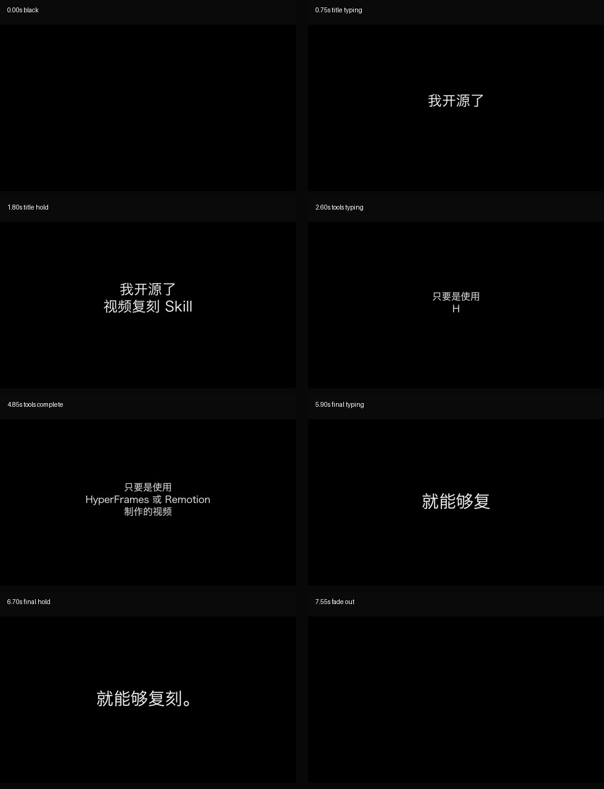

# Black White Text Opener

用于制作新视频开头：纯黑/近黑背景，白色文字一个字一个字打出来，并同步短促 typing click 音效。

[▶ Watch Black White Text Opener](https://github.com/user-attachments/assets/3962d773-4447-4720-ba59-5e164d0b5ac4)

质检抽帧：



## 做什么类型的视频

- 教程视频开场
- 观点视频开头
- 产品/开源项目发布片头
- 暗色 SaaS 正片前的极简引子

## 视频风格

- 纯黑或近黑背景
- 白色大字
- 字符逐个出现，不是一整行突然淡入
- 每个可见字符配轻微 typing click
- 最后一行短暂停留，再切入正片

## Timing Plan

这个 skill 的脚本会生成可执行 plan：

- `typing_events`：每个字符出现的时间点。
- `sfx_events`：每个打字音效的时间点、音量和轻微 pitch 变化。
- `warnings`：如果文案太长、打字速度过快，会提示调整。

示例：

```bash
python3 rn-bw-text-opener/scripts/create_opener_plan.py \
  --title "我开源了 视频复刻 Skill" \
  --replace "HyperFrames" "Remotion" \
  --final "就能够复刻。" \
  --preset slow \
  --typing-cps 12 \
  --out opener-plan.json
```

## 适合使用

- "做一个黑底白字开场。"
- "白色文字一个个出来。"
- "加打字音效。"
- "做一个视频标题开场。"

## 不适合使用

- 不用于复刻原片开头。
- 不声明像素级对齐。
- 不用于完整 SaaS 产品短片；完整产品短片更适合 `rn-dark-saas-video`。

## 安装

```bash
npx skills add https://github.com/Pluviobyte/rnskill --skill rn-bw-text-opener
```
