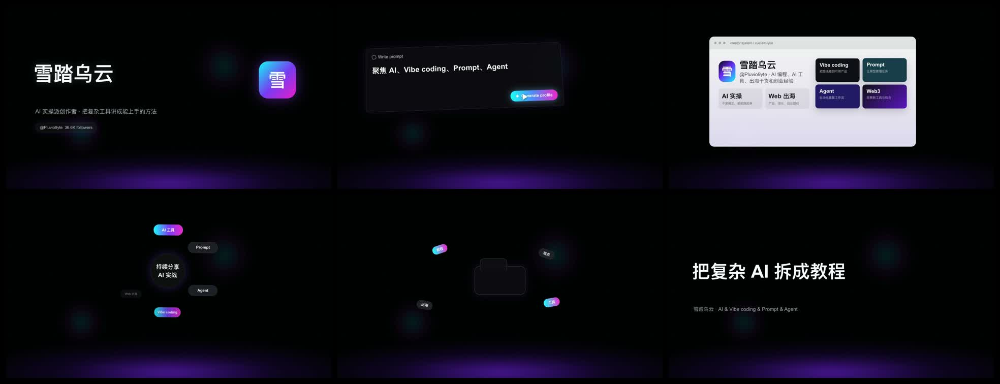

# Dark SaaS Magic Video（暗色 SaaS 魔术短片）

用于制作暗色 cinematic SaaS / AI 产品短片，适合工具发布、产品能力展示、AI 工作流演示和 Presenton-like magic UI 风格视频。

质检抽帧：



## 示例成片：雪踏乌云暗色 SaaS 介绍短片

[▶ Watch Xuetawuyun Dark SaaS Showcase](https://github.com/user-attachments/assets/6d4236af-6b58-4447-986d-21169ea5e3a6)

- 主体：雪踏乌云 / @Pluvio9yte
- 主张：把复杂 AI 拆成教程
- 时长：12 秒
- 规格：1920x1080，30fps，H.264 + AAC
- 文件：`rn-dark-saas-video/assets/showcases/xuetawuyun-dark-saas-showcase-1080p.mp4`

## 做什么类型的视频

- AI 产品介绍短片
- SaaS 功能发布视频
- 工具/开源项目发布片
- 黑色科技感 UI 动效片

## 视频风格

- 近黑背景和弱紫色底部辉光
- 大号白色 kinetic typography
- 青蓝到洋红渐变 CTA
- 漂浮 UI 卡片、模板、窗口、徽章、模型环
- speed blur、white wipe、scale rush 转场

## 适合使用

- "做一个类似 Presenton 的暗色 SaaS 产品短片。"
- "做成这种 magic UI 风格。"
- "我要一个 AI 工具发布视频。"

## 不适合使用

- 不用于逐帧复刻参考视频。
- 不用于黑底白字单独开场。那更适合 `rn-bw-text-opener`。

## 安装

```bash
npx skills add https://github.com/Pluviobyte/rnskill --skill rn-dark-saas-video
```
